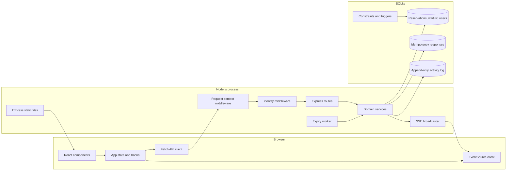
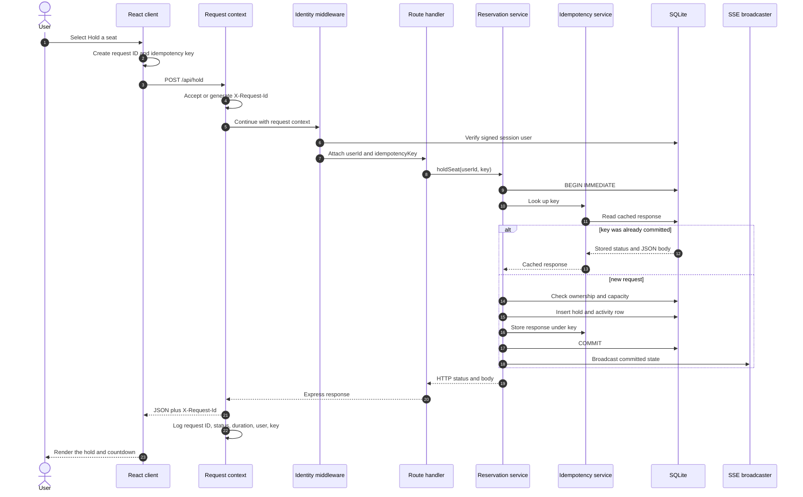
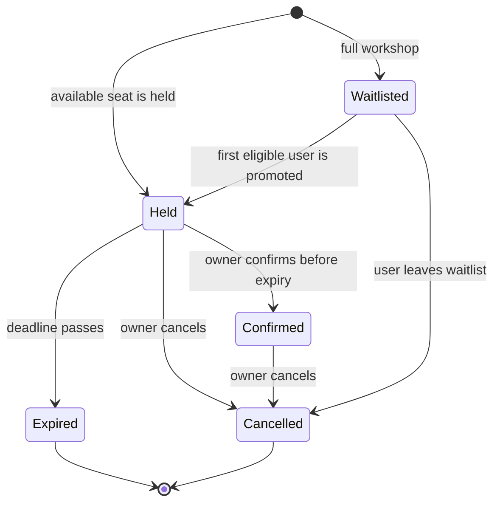

# SeatLock architecture

This document explains the system boundaries, request path, concurrency model, and the backend concepts used by SeatLock. For the responsibility and data flow of every source file, see [FILE-GUIDE.md](FILE-GUIDE.md).

## System architecture

The browser never decides whether capacity is available. It renders server state and sends authenticated commands. Express authenticates the caller, services apply domain rules inside SQLite transactions, and Server-Sent Events notify connected clients after the transaction commits.

## Request and response trace

Every API response contains an `X-Request-Id` header. The browser sends one when it uses `apiRequest`; external clients may supply a valid ID or let the server generate one. The server writes one structured completion log containing the same ID.

Trace fields have different purposes:

| Field | Scope | Purpose |
| --- | --- | --- |
| `X-Request-Id` | One HTTP attempt | Connect browser network activity, the response, and the server completion log. |
| `Idempotency-Key` | One logical command and all its retries | Prevent a retry from creating another state change. |
| `reservation_id` | One reservation lifecycle | Connect hold, confirmation, cancellation, or expiry timeline entries. |
| `user_id` | Authenticated owner | Enforce ownership and show user-specific status. |

Do not use a request ID as an idempotency key. A transport retry is a new HTTP attempt and can have a new request ID, while it must reuse the original idempotency key.

## Domain states

Only `held` and `confirmed` rows remain in `reservations`. `expired` and `cancelled` are terminal events stored in `activity_log`. Waitlist membership is stored separately.

## Concurrency and capacity

SeatLock uses several layers because no single application check is enough:

1. A service starts a SQLite immediate transaction before reading capacity. Competing writers cannot both reserve the last seat.
2. A capacity trigger rejects an insert when active reservations already equal the configured limit.
3. Unique constraints prevent more than one reservation or waitlist row per user.
4. Cross-table triggers prevent a user from being both reserved and waitlisted.
5. State triggers reject malformed combinations such as a confirmed reservation with an expiry time.
6. The idempotency response is written in the same transaction as the domain change.

WAL mode lets readers continue while a writer is active. SQLite still serializes writers, which is suitable for one small workshop and short transactions. A higher-volume deployment would move these rules to PostgreSQL and use row locks or serializable transactions.

## Expiry and restart recovery

The expiry worker runs once during startup and then on an interval. Availability-sensitive requests also sweep expired holds. A sweep deletes each expired row, appends an expiry event, and calls waitlist promotion once for that freed seat inside the same transaction. This means a server restart cannot make an expired hold valid again.

## Authentication and ownership

Registration stores an `scrypt` hash and random salt. Login returns a signed session token in an `HttpOnly`, `SameSite=Strict` cookie. API clients may send the token as a bearer token. Reservation endpoints never accept a target user ID from the body; they use only the user ID derived from the verified session.

Tabs in one browser profile share that cookie. The client announces login/logout through a non-secret local-storage marker, refreshes `/api/auth/me` on storage changes and window focus, and clears previous-account state. Requests include `X-SeatLock-User` with the displayed ID. Middleware compares it with the verified identity and returns `409 SESSION_CHANGED` before any reservation change if they differ. The header is a consistency check, never an authentication credential. Late responses and user-specific SSE events are ignored when they belong to a previous session. Use separate browser profiles or normal/private sessions for an independent two-user demo.

The current authentication is appropriate for a local project. Production campus use should replace local passcodes with institutional identity, add login rate limiting, use HTTPS with secure cookies, and define account recovery.

## Live updates

Server-Sent Events are used because updates travel mainly from server to browser. They are simpler than WebSockets for this one-way stream, reconnect automatically in the browser, and work over normal HTTP. Availability is public to every authenticated connection. A user status event is sent only to connections owned by that user.

## Backend concepts to understand

Be prepared to explain these from the code:

- HTTP middleware order: request context, JSON parsing, authentication, routes, and error handling.
- Authentication versus authorization: proving identity is separate from checking ownership.
- Transactions: related reads and writes commit together or roll back together.
- Database constraints: invariants remain protected even if service code has a defect.
- Idempotency: a retry returns the stored result rather than repeating the command.
- Optimistic UI versus server authority: SeatLock waits for the server before changing reservation state.
- Background work: expiry is repeated and safe after restarts.
- SSE lifecycle: initial snapshot, event delivery, keep-alive, reconnect, and cleanup.
- Integration testing: tests use real HTTP, a real SQLite database, process restarts, and a real browser.

## Known boundaries

- One workshop is configured in the database. Supporting multiple workshops would add `workshop_id` to capacity, reservations, waitlist, idempotency scope, and activity indexes.
- SQLite is intentionally local and single-region.
- The activity feed exposes campus IDs to authenticated users. A production privacy policy may require masking or an administrator-only feed.
- Idempotency records currently have no retention job. A long-running deployment should define a retention period that is longer than the maximum client retry window.
